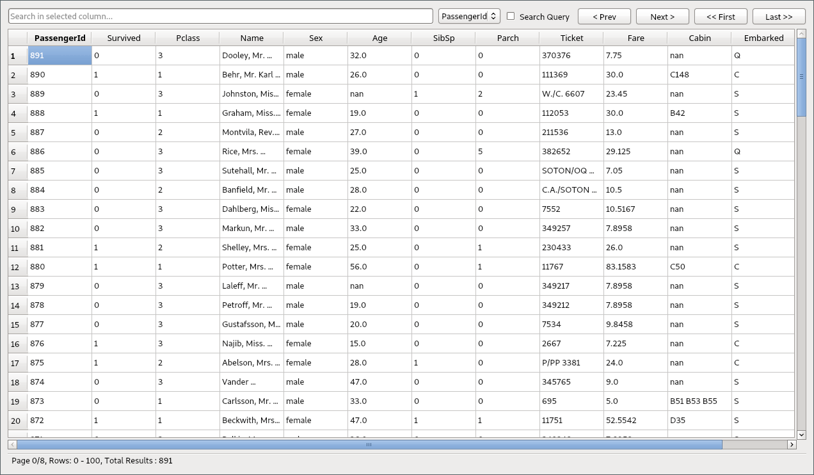
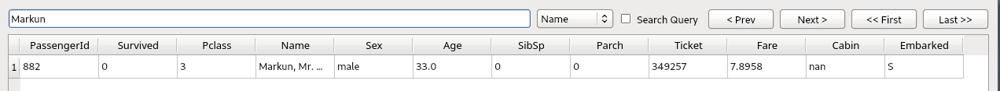
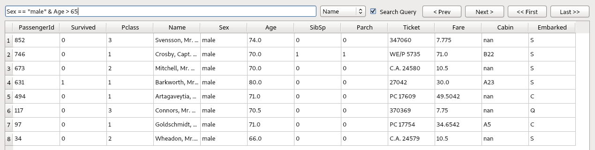

# dfviewer
dfviewer is PyQt5 based a data view tool for pandas data frames working on Jupyter Notebook or IPython.
## Installation

```
pip install dfviewer
```

## Usage
```python
from dfviewer import v
import pandas as pd
df = pd.read_csv(r'https://raw.githubusercontent.com/datasciencedojo/datasets/master/titanic.csv')
v(df)
```

You can set number of rows displayed per page. Default value is 100. For example:
```python
v(dataFrame, 500)
```
### Sorting
You can easily sort all the data by double-clicking the column headers. When you double-click on the header again, ascending sorting option will be active.

### Searching

#### Regular Search
Using the search bar at the top, you can search within the columns of the dataframe. To trigger the search, you need to press the enter key after typing the word to be searched for. You can change the column to be searched with the combo box to the right of the search bar.



#### Pandas Query
You can use pandas queries to perform more complex (for example, conditional search) searches. To enable this option, click on the "Search Query" box next to the search bar. Then type the query in the search box and press the enter key.



## Known bugs
- Dataframe indexes should not be multi index.
- All column names must be string.
